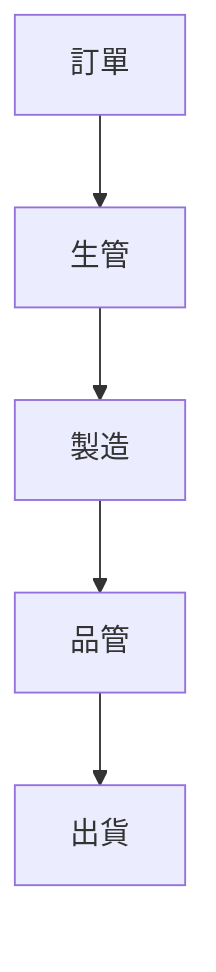
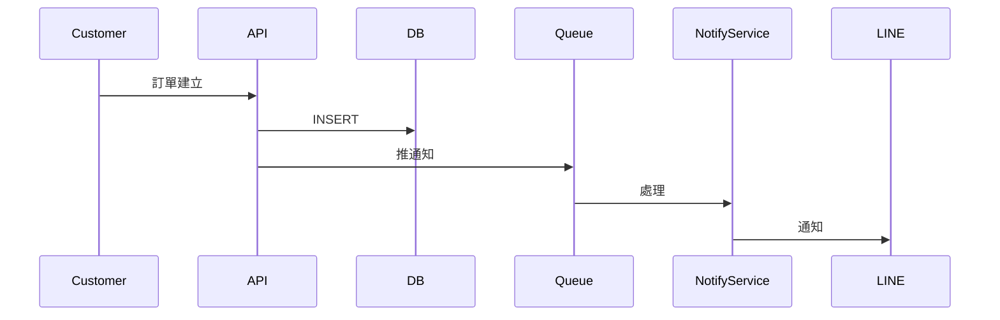

# Diagrams

本目錄存放圖檔來源檔（Excalidraw、draw.io、Figma 等）。
最終匯出圖（PNG / SVG）放 `diagrams/exports/`。

## 為什麼要有 source 檔

- 提案改一輪、圖跟著改一輪
- 截圖不可改、來源檔可改
- 不同案件可以從同樣 template 衍生

## 必有的圖

對應 [templates/architecture-diagram-checklist.md](../templates/architecture-diagram-checklist.md)。

### 通用 template

| 圖 | 來源檔 | 用途 |
|---|---|---|
| 4 層架構圖（業務 / 資料 / 應用 / 技術）| `templates/4-layer-architecture.excalidraw` | 模組 08 |
| 導入前後差異圖 | `templates/before-after.excalidraw` | 模組 04 / 11 效益 |
| 服務藍圖 | `templates/service-blueprint.excalidraw` | 模組 04 |
| RACI 矩陣 | `templates/raci.excalidraw` | 模組 05 |
| 資料流向圖 | `templates/data-flow.excalidraw` | 模組 06 |
| 威脅模型（STRIDE）| `templates/threat-model-stride.excalidraw` | 模組 07 / 強制檢查項 D |
| 分階段路線圖（Gantt 簡化版）| `templates/phased-roadmap.excalidraw` | 模組 09 |
| 競品定位四象限 | `templates/competitor-quadrant.excalidraw` | 模組 02 |
| 風險矩陣（影響 × 機率）| `templates/risk-matrix.excalidraw` | 模組 12 |

### 產業 template（在 `templates/industry/`）

| 產業 | 必有圖 |
|---|---|
| 製造 | Purdue / ISA-95 分層圖、OEE 計算示意 |
| 醫療 | HL7 FHIR 整合圖、SaMD 分類 |
| 食品 | 冷鏈追溯流程圖、HACCP 七原則 |
| 能源 ESG | Scope 1/2/3 範疇圖 |

## 工具建議

| 工具 | 適合 | License | 備註 |
|---|---|---|---|
| **Excalidraw** | 手繪感、討論用、版控友善 | MIT | `.excalidraw` 是 JSON、git diff 可讀 |
| **draw.io / diagrams.net** | 標準 IT 圖示 | Apache 2.0 | `.drawio` 是 XML |
| **Mermaid** | 文件內嵌、版控 | MIT | 在 markdown 內直接寫 |
| **PlantUML** | 程式碼產圖 | GPL（小心 SaaS 用）| 適合 sequence / class |
| **Lucidchart** | 大型 / 協作 | 商業 | 需付費 |
| **Figma** | UI / 互動原型 | 免費 + 付費 | 適合 mockup |

## Mermaid 範例（可直接嵌入 markdown）





## 目錄結構（未來建立時）

```
diagrams/
├── README.md（本檔）
├── templates/
│   ├── 4-layer-architecture.excalidraw
│   ├── before-after.excalidraw
│   ├── ...
│   └── industry/
│       ├── purdue-isa95.excalidraw
│       └── ...
└── exports/
    ├── 4-layer-architecture.svg
    └── ...
```

⚠️ 目前 `templates/` 與 `exports/` 子目錄尚未建立 — 等實際做提案時依需求補。

## 風格規範

- 顏色：藍 = 我方、灰 = 既有系統、橘 = 客戶端、紅 = 外部威脅
- 字型：英文 Inter / Roboto、中文 Noto Sans CJK
- 線型：實線 = 同步、虛線 = 異步、粗線 = 主流程
- 圖例 / 版本號 / 日期：每張圖左下角必有
