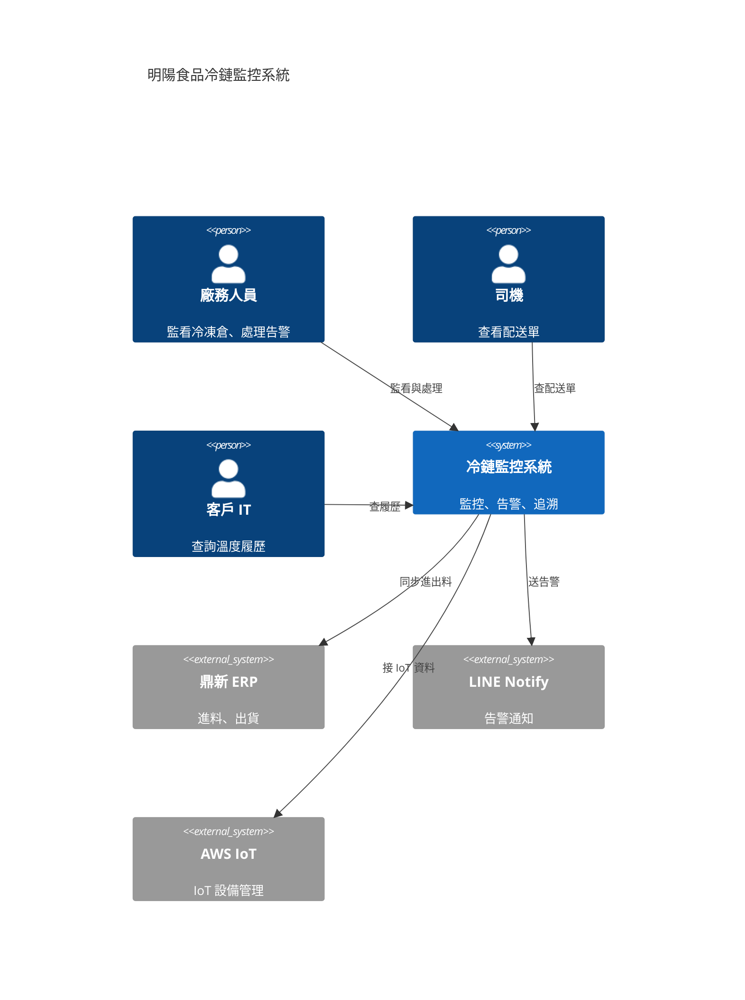

# C4 Model

Simon Brown 提出的軟體架構描述方法。**現代軟體架構圖事實標準**。
比 TOGAF 4 層更聚焦軟體系統、比 UML 更輕量。

## 四層 + 兩個補充

```
┌──────────────────────────────────────┐
│ Level 1: System Context              │
│ 系統跟外部 actor 的關係                │
│ → 給高層、業務看                       │
├──────────────────────────────────────┤
│ Level 2: Container                   │
│ 系統內主要應用 / 服務 / DB             │
│ → 給 PM、業務 IT 看                   │
├──────────────────────────────────────┤
│ Level 3: Component                   │
│ 容器內的元件 / 模組                    │
│ → 給開發看                             │
├──────────────────────────────────────┤
│ Level 4: Code（很少畫到這層）         │
│ Class、interface                     │
│ → 給開發深度看                         │
└──────────────────────────────────────┘

補充：
- Deployment Diagram（部署到實體環境）
- System Landscape（多系統 / 整個 enterprise）
```

## 跟 TOGAF 4 層的對應

| TOGAF | C4 | 給誰看 |
|---|---|---|
| Business Architecture | System Context（涉及業務） | 高層、業務 |
| Application Architecture | Container | PM、IT |
| Application Architecture | Component | 開發 |
| Data Architecture | Container + Component（DB / 訊息）| IT、開發 |
| Technology Architecture | Deployment | DevOps、SRE |

**兩個一起用最好**：
- TOGAF 給「企業架構」視角（業務 / 資料 / 應用 / 技術）
- C4 給「軟體架構」視角（從外到內、從粗到細）

## Level 1: System Context

最高層、給高層看。

```
      [客戶 / 終端用戶]
            │
            ▼
       ┌──────────┐
       │  本系統  │ ←── [我方員工]
       └──────────┘
            ▲
            │
   [外部系統 1: 鼎新 ERP]
   [外部系統 2: LINE Notify]
   [外部系統 3: AWS IoT]
```

必含：
- 中央：你的系統（一個 box）
- 周圍：所有使用者 / actor
- 周圍：所有外部系統 / 服務
- 連線：方向、用途

❌ 不含：技術細節、DB schema、API 細節

## Level 2: Container

把系統打開、看主要容器。

```
本系統內：
┌─────────────┐      ┌─────────────┐
│   Web App   │ ←──→ │  API Gateway│
│  (React)    │      │             │
└─────────────┘      └──────┬──────┘
                             │
       ┌─────────────────────┼──────────────────┐
       ▼                     ▼                  ▼
┌────────────┐       ┌────────────┐    ┌────────────┐
│ Lambda     │       │ Lambda     │    │ Lambda     │
│ 告警服務   │       │ 履歷服務   │    │ 報表服務   │
└────────┬───┘       └────────┬───┘    └────────┬───┘
         │                    │                 │
         └────────┬───────────┴─────────────────┘
                  ▼
         ┌─────────────────┐
         │ Database (RDS)  │
         └─────────────────┘
```

容器 = 可獨立部署的單位：
- Web app
- API
- 後端服務（microservice、Lambda）
- 資料庫
- 訊息佇列
- 檔案儲存

每個容器要寫：技術棧、責任、依賴。

## Level 3: Component

把單一容器打開、看內部元件。

例：告警服務 Lambda 內：
- Rule Engine（評估告警規則）
- Notification Dispatcher（決定送 LINE / Email / Push）
- LINE Adapter / Email Adapter / Push Adapter
- Escalation Manager（15min 未確認升級）

→ 給開發看、PM 不必看。

## Level 4: Code

UML class diagram、interface、繼承關係。
**絕大多數提案不畫到這層**。

## C4 圖的標準元素

| 元素 | 形狀 | 內容 |
|---|---|---|
| Person | 圓頭人形 | 角色名 + 1 句描述 |
| Software System | 圓角方框 | 系統名 + 1 句描述 |
| Container | 方框 | 容器名 + [技術棧] + 1 句描述 |
| Component | 方框 | 元件名 + 1 句描述 |
| Relationship | 帶箭頭線 | 動詞 + 技術（例：「呼叫 [HTTPS/JSON]」） |

## 跟 ProposalOS 整合

### 模組 08 系統架構章節

**目前**：4 層 TOGAF（業務 / 資料 / 應用 / 技術）

**升級**：

```
模組 08 給 4 層架構圖（TOGAF 觀點、給高層 / 法務）
   +
C4 補強：
- Level 1 System Context（給客戶高層）
- Level 2 Container（給客戶 IT）
- Level 3 Component（給客戶 Tech Lead，深度討論時）
```

### 提案文件中放哪一層

| 文件 | 應該放 |
|---|---|
| 執行摘要 | C4 L1 縮圖（System Context） |
| 主提案書架構章節 | TOGAF 4 層 + C4 L1 + L2 |
| 技術深度討論 | C4 L2 + L3 + Deployment |
| 開發階段內部文件 | C4 L3 + L4 |

## 工具

| 工具 | 適合 |
|---|---|
| **C4-PlantUML** | 文字寫 → 自動畫、版控好 |
| **Structurizr** | C4 官方、Simon Brown 公司產品 |
| **Mermaid C4** | Markdown 直接嵌 |
| **Draw.io / Lucidchart C4 模板** | 拖拉 |
| **Excalidraw** | 手繪感 |

## Mermaid C4 範例



## 常見錯誤

- ❌ 一張圖塞 4 層（看不懂）
- ❌ Context 圖塞技術細節（高層看不懂）
- ❌ Container 圖只畫盒子不寫技術棧（IT 看不出哪個是 Lambda、哪個是 RDS）
- ❌ 用 UML 等其他標準取代 C4（C4 是當代軟體圈共識，特別易讀）

## 推薦

- c4model.com（官方）
- Simon Brown《Software Architecture for Developers》
